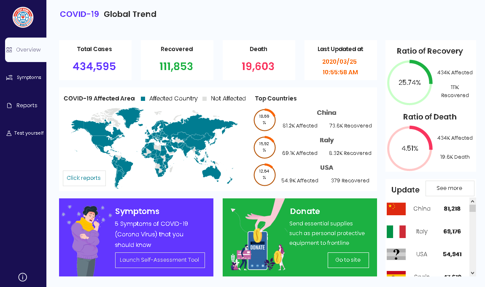
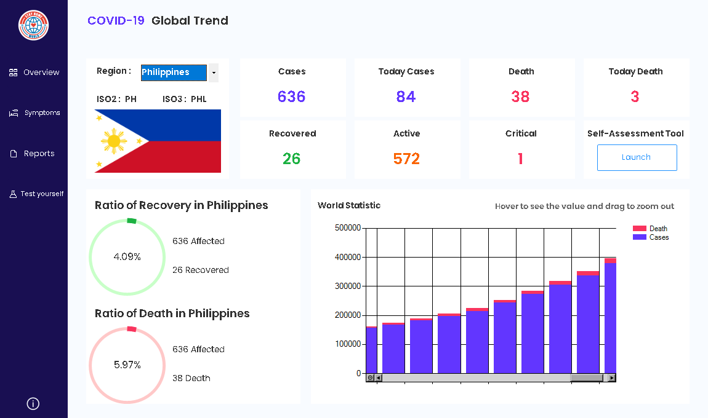
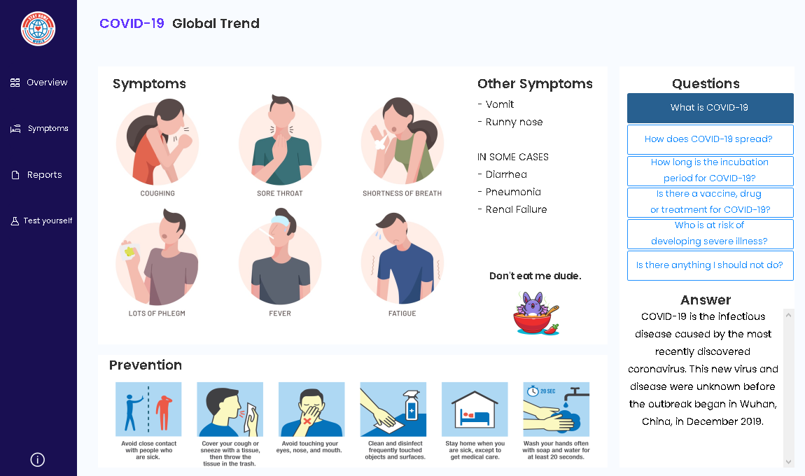
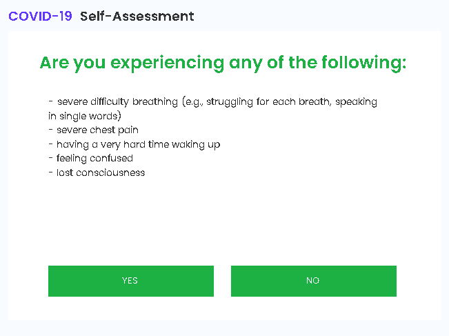
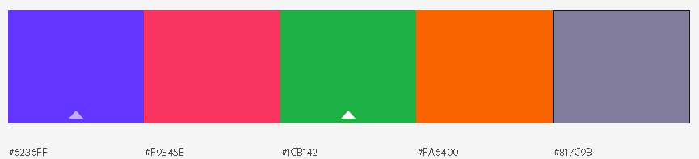
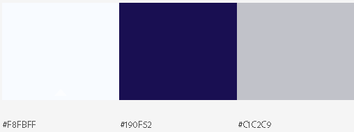

  

<h1 align="center">COVID-19 Desktop Application</h1>

## Why?
As soon I saw someone posted web application for this covid-19, I search/research if someone already created an a desktop application for covid-19 tracker since I don't see any app. I decided to create and make it simple. [Fixing Installer/Setup]()

## Interface

  

  

  

  

  

## Features
I have always wanted to keep the app simple to make sure it loads faster but still get the most out of the data.

 - Total deaths
 - Total reported case
 - Total confirmed case
 - Automatic current country detection
 - Switch between countries to see the total affected numbers
 - Self-Assessment tool for checking if you have covid-19
 - Ratio of Recovery and Death
 - Donation
 - Prevention for covid-19
 - Download json.file for offline use
 - Offline and Online mode
 
 ## Built With

* [Bunifu Framework](https://bunifuframework.com/) - The .net framework used
* [Newtonsoft.Json](https://www.newtonsoft.com/json) - Used to deserialize json format

## Color used
 - 
 - 

## Acknowledgments
* Hat tip to anyone whose code was used
* Inspiration for design
* [API LINK](https://github.com/mathdroid/covid-19-api) - Used to get data about covid-19
* [API LINK](https://github.com/NovelCOVID/API) - Another API used to get data about covid-19
